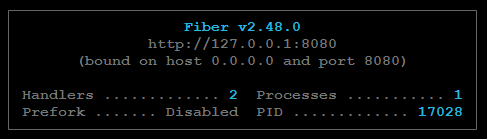

## Golang Rest API with Python


A Golang Rest API project with Postgres as the Database. Used Python 
```requests``` 
to fetch the data from the API.

### Requirements to get started
1. You must have <a href="https://go.dev/doc/install">Golang installed</a> in your system.
2. You must also have <a href="https://www.python.org/downloads/">Python installed</a> in your system as well.
3. Lastly, you will need to have <a href="https://www.postgresql.org/download/">PostgreSQL installed</a>

### Project Setup
- <a href="https://www.freecodecamp.org/news/how-to-fork-a-github-repository/#:~:text=To%20follow%20along%2C%20browse%20to,created%20under%20your%20GitHub%20account.">Fork this repo</a> into your own Github
- Then clone the repo into your system
    ```git clone url <directory>```
- Run the following command on the terminal:
    ```go mod init [module-name]```
- Followed by this command which will install all the golang dependencies: ```go mod tidy```
- Create a ```.env``` file on the main folder and add the following code with your details:
    ```env
    DB_HOST=127.0.0.1
    DB_PORT=5432
    DB_PASSWORD=[your password]
    DB_USER=[username]
    DB_NAME=[database name]
    DB_SSLMODE=disable
    ```
- Run the following command in your terminal:
    ```terminal
    python3 -m pip install requests
    ```

### Postgres Setup
- Run the following commands on your postgres terminal/admin
    ```sql
    CREATE TABLE users (
        user_id numeric(10, 0) NOT NULL,
        name character varying(50) COLLATE pg_catalog."default" NOT NULL,
        age numeric(3, 0) NOT NULL,
        phone character varying(20) COLLATE pg_catalog."default",
        CONSTRAINT user_table_pkey PRIMARY KEY (user_id)
    );

    INSERT INTO users (user_id, name, age, phone) VALUES (3, 'Jenny', 34, NULL);
    INSERT INTO users (user_id, name, age, phone) VALUES (2, 'Tom', 29, '1 800 123 1234');
    INSERT INTO users (user_id, name, age, phone) VALUES (1, 'John', 28, NULL);
    ```
> I am using vscode as my code editor. <a href="https://youtu.be/ezjoDYs72GA">Watch</a> to connect postgres to vscode

### Running the project
>You need to open two terminals, one for the server and the other for the request.

#### On the server terminal
> Make sure you are on the main directory of the project
- Run the following commmand
    ```terminal
    go run main.go
    ```
- This should open up something like this on the terminal
    

#### On the request terminal
- Run the following command
    ```terminal
    cd frontend
    python3 main.py
    ```
- Then you shall see your data in a ```json``` format

**Feel free to log any issues you have or become a contributer to the project**